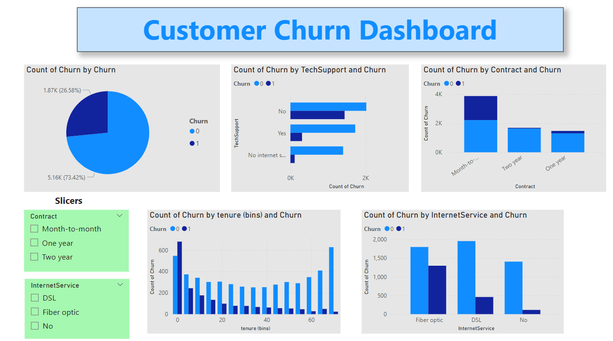

# 🧠 Customer Churn Prediction Project

This project predicts customer churn using machine learning and visualizes insights with Power BI.

## 🚀 Tools Used
- Python (Pandas, Scikit-learn, Seaborn)
- Jupyter Notebook
- Power BI for visualization
- SMOTE for imbalance handling

## 📊 Dataset
- Telco Customer Churn Dataset from Kaggle
- Includes features like contract type, monthly charges, tech support, etc.

## 🎯 Goal
Predict whether a customer will churn (leave the service) based on their profile.

## 📈 Model Performance
- Algorithm: Random Forest Classifier
- Accuracy: 77%
- Top features: tenure, total charges, contract type

## 📂 Files
- `churn_model.ipynb` → ML model + EDA
- `Churn_Dashboard.pbix` → Power BI dashboard
- `ml_ready_data.csv`, `powerbi_ready_data.csv` → Cleaned datasets

## 🖼️ Dashboard Preview

## 🙋‍♀️ Author
Mohamed Saad
